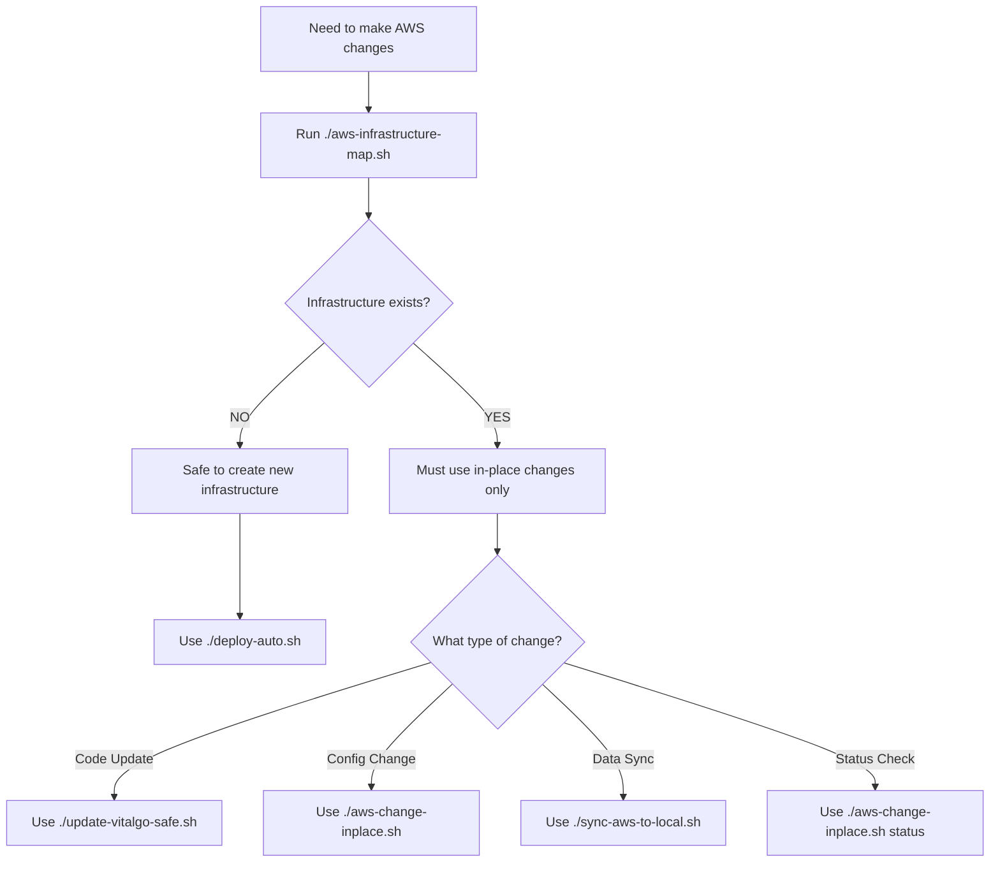

# VitalGo AWS Infrastructure Workflow Guide

## 🎯 Complete Workflow for Safe AWS Management

This guide provides the **COMPLETE WORKFLOW** to safely manage VitalGo infrastructure without accidentally recreating existing resources.

## 🚀 Quick Start Commands

### 1. First Time Setup (No Infrastructure Exists)
```bash
# Discover current state
./aws-infrastructure-map.sh

# If no infrastructure found, create from scratch
./deploy-auto.sh
```

### 2. Daily Development (Infrastructure Exists)
```bash
# 1. Discover what exists
./aws-infrastructure-map.sh

# 2. Sync AWS data to local for development
./sync-aws-to-local.sh

# 3. Make changes locally and test

# 4. Deploy changes safely (preserves database)
./update-vitalgo-safe.sh
```

### 3. Configuration Changes (Infrastructure Exists)
```bash
# Interactive menu for in-place changes
./aws-change-inplace.sh

# Or specific operations:
./aws-change-inplace.sh update     # Update code
./aws-change-inplace.sh status     # Check status
./aws-change-inplace.sh config     # Update config
./aws-change-inplace.sh migrate    # Database migrations
```

## 📊 Decision Tree



## 🔧 Detailed Workflows

### Workflow A: Project Initialization (First Time)

**Scenario:** Starting VitalGo project from scratch, no existing AWS resources.

```bash
# Step 1: Verify no existing infrastructure
./aws-infrastructure-map.sh
# Expected output: "NO EXISTING INFRASTRUCTURE FOUND"

# Step 2: Create infrastructure from scratch
./deploy-auto.sh
# This creates: EC2, RDS, S3, Security Groups, etc.

# Step 3: Verify deployment
./aws-infrastructure-map.sh
# Expected output: "EXISTING INFRASTRUCTURE DETECTED"

# Step 4: Access application
# Frontend: http://35.169.20.114:3000
# Backend: http://35.169.20.114:8000
# SSH: ssh -i ~/.ssh/vitalgo-key.pem ec2-user@35.169.20.114
```

### Workflow B: Daily Development (Infrastructure Exists)

**Scenario:** Regular development work, AWS infrastructure already exists.

```bash
# Step 1: Confirm infrastructure exists
./aws-infrastructure-map.sh
# Expected output: "EXISTING INFRASTRUCTURE DETECTED"

# Step 2: Sync production data to local for testing
./sync-aws-to-local.sh
# Requires confirmation: Type 'SYNC_AWS_TO_LOCAL'

# Step 3: Develop locally
# - Make code changes
# - Test with real data from AWS
# - Fix bugs, add features

# Step 4: Deploy changes safely
./update-vitalgo-safe.sh
# This updates ONLY containers, preserves database

# Step 5: Verify deployment
curl -s http://35.169.20.114:8000/health
curl -s http://35.169.20.114:3000
```

### Workflow C: Configuration Updates (Infrastructure Exists)

**Scenario:** Need to change environment variables, scale services, or update configuration.

```bash
# Step 1: Check current status
./aws-change-inplace.sh status

# Step 2: Make configuration changes
./aws-change-inplace.sh
# Interactive menu:
# 1. Update application code
# 2. Update environment configuration
# 3. Update Nginx configuration
# 4. Scale services
# 5. Apply database migrations
# 6. Show current status

# Or use direct commands:
./aws-change-inplace.sh update    # Update containers
./aws-change-inplace.sh config    # Update environment
./aws-change-inplace.sh migrate   # Run migrations
```

### Workflow D: Database Migrations (Infrastructure Exists)

**Scenario:** Need to apply database schema changes.

```bash
# Step 1: Ensure backup strategy
./aws-change-inplace.sh migrate
# This will:
# - Create automatic backup before migration
# - Ask for confirmation
# - Apply Alembic migrations
# - Verify results

# Alternative manual approach:
ssh -i ~/.ssh/vitalgo-key.pem ec2-user@35.169.20.114
cd vitalgo
sudo docker exec vitalgo-postgres-1 pg_dump -U backend_user -d backend_db > backup.sql
sudo docker exec vitalgo-backend-1 python -m alembic upgrade head
```

### Workflow E: Troubleshooting (Infrastructure Exists)

**Scenario:** Something is wrong, need to diagnose and fix.

```bash
# Step 1: Get comprehensive status
./aws-infrastructure-map.sh
./aws-change-inplace.sh status

# Step 2: Check application logs
ssh -i ~/.ssh/vitalgo-key.pem ec2-user@35.169.20.114
sudo docker logs vitalgo-backend-1
sudo docker logs vitalgo-frontend-1
sudo docker logs vitalgo-postgres-1

# Step 3: Restart services if needed
sudo docker-compose -f docker-compose.aws-safe.yml restart backend
sudo docker-compose -f docker-compose.aws-safe.yml restart frontend

# Step 4: If database issues, check connectivity
sudo docker exec vitalgo-postgres-1 pg_isready -U backend_user
sudo docker exec vitalgo-postgres-1 psql -U backend_user -d backend_db -c "SELECT COUNT(*) FROM users;"
```

## 🚨 Emergency Procedures

### Emergency A: Services Down But Infrastructure Intact

```bash
# Quick diagnosis
./aws-change-inplace.sh status
ssh -i ~/.ssh/vitalgo-key.pem ec2-user@35.169.20.114 "sudo docker ps -a"

# Restart all services
ssh -i ~/.ssh/vitalgo-key.pem ec2-user@35.169.20.114
cd vitalgo
sudo docker-compose -f docker-compose.aws-safe.yml up -d

# Verify recovery
./aws-change-inplace.sh status
```

### Emergency B: Database Corruption

```bash
# Check latest backup
ssh -i ~/.ssh/vitalgo-key.pem ec2-user@35.169.20.114 "ls -la vitalgo/backup_*.sql"

# Restore from backup (if needed)
ssh -i ~/.ssh/vitalgo-key.pem ec2-user@35.169.20.114
cd vitalgo
sudo docker exec -i vitalgo-postgres-1 psql -U backend_user -d backend_db < backup_LATEST.sql
```

### Emergency C: Complete Infrastructure Loss

```bash
# Step 1: Assess damage
./aws-infrastructure-map.sh
aws ec2 describe-instances
aws rds describe-db-instances

# Step 2: If infrastructure is completely gone
# WARNING: This will recreate everything from scratch
./deploy-auto.sh

# Step 3: Restore data from backups if available
# (This requires manual intervention based on available backups)
```

## 📋 Pre-Operation Checklists

### Before ANY AWS Operation:
- [ ] Run `./aws-infrastructure-map.sh` to understand current state
- [ ] Identify if infrastructure exists or not
- [ ] Choose appropriate workflow based on findings
- [ ] Understand the impact of the intended change
- [ ] Have a rollback plan
- [ ] Verify backup availability (for database changes)

### Before Infrastructure Creation:
- [ ] Confirm no existing infrastructure (avoid duplicates)
- [ ] Verify AWS credentials and permissions
- [ ] Check AWS service limits and costs
- [ ] Document what will be created

### Before Infrastructure Modification:
- [ ] Confirm infrastructure exists
- [ ] Create backups of critical data
- [ ] Test changes in local environment first
- [ ] Use appropriate safe scripts only

## 🔄 Rollback Procedures

### Code Rollback:
```bash
# Option 1: Redeploy previous version from local
git checkout PREVIOUS_COMMIT
./update-vitalgo-safe.sh

# Option 2: Restart containers with previous images
ssh -i ~/.ssh/vitalgo-key.pem ec2-user@35.169.20.114
cd vitalgo
sudo docker-compose -f docker-compose.aws-safe.yml pull gruporq/vitalgo-backend:PREVIOUS_TAG
sudo docker-compose -f docker-compose.aws-safe.yml up -d
```

### Configuration Rollback:
```bash
ssh -i ~/.ssh/vitalgo-key.pem ec2-user@35.169.20.114
cd vitalgo
cp .env.backup.TIMESTAMP .env
sudo docker-compose -f docker-compose.aws-safe.yml restart backend
```

### Database Rollback:
```bash
ssh -i ~/.ssh/vitalgo-key.pem ec2-user@35.169.20.114
cd vitalgo
sudo docker exec -i vitalgo-postgres-1 psql -U backend_user -d backend_db < backup_TIMESTAMP.sql
```

## 🎯 Success Metrics

After any operation, verify:
- [ ] Frontend accessible: `curl -s http://35.169.20.114:3000`
- [ ] Backend API healthy: `curl -s http://35.169.20.114:8000/health`
- [ ] Database responsive: Database query returns expected results
- [ ] All containers running: `docker ps` shows healthy containers
- [ ] Logs show no critical errors
- [ ] Application functionality works as expected

## 📚 Reference Commands

### Quick Status Checks:
```bash
# Infrastructure overview
./aws-infrastructure-map.sh

# Application status  
./aws-change-inplace.sh status

# Container status
ssh -i ~/.ssh/vitalgo-key.pem ec2-user@35.169.20.114 "sudo docker ps"

# Database status
ssh -i ~/.ssh/vitalgo-key.pem ec2-user@35.169.20.114 "sudo docker exec vitalgo-postgres-1 pg_isready -U backend_user"

# Service health
curl -s http://35.169.20.114:8000/health
curl -s http://35.169.20.114:3000 | head -1
```

### Data Operations:
```bash
# Sync AWS to local
./sync-aws-to-local.sh

# Manual backup
ssh -i ~/.ssh/vitalgo-key.pem ec2-user@35.169.20.114 "sudo docker exec vitalgo-postgres-1 pg_dump -U backend_user -d backend_db > backup_$(date +%Y%m%d_%H%M%S).sql"

# Database query
ssh -i ~/.ssh/vitalgo-key.pem ec2-user@35.169.20.114 "sudo docker exec vitalgo-postgres-1 psql -U backend_user -d backend_db -c 'SELECT COUNT(*) FROM users;'"
```

### Deployment Operations:
```bash
# Safe deployment (preserves data)
./update-vitalgo-safe.sh

# In-place changes
./aws-change-inplace.sh update

# Configuration updates
./aws-change-inplace.sh config
```

This workflow guide ensures you **NEVER accidentally recreate infrastructure** and always make changes safely in-place.