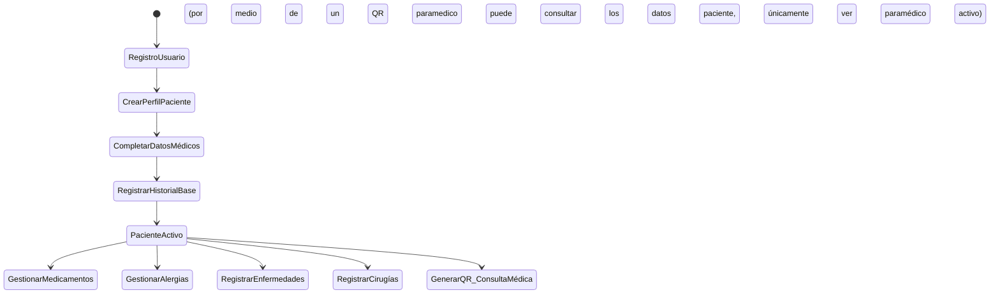
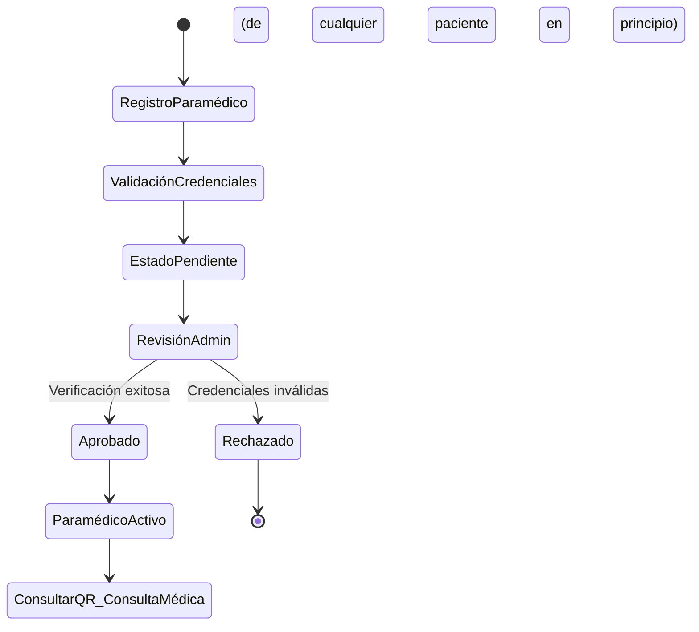

# ESPECIFICACIÓN DE DOMINIO - SISTEMA VITALGO
## Matriz de Dominio y Plan de Implementación

---

## 🏥 **1. VISIÓN GENERAL DEL DOMINIO**

### **1.1 Contexto del Negocio**
Sistema de gestión médica integral para el manejo de información crítica de pacientes, con enfoque en:
- Gestión del historial médico completo
- Control de acceso diferenciado por roles
- Trazabilidad de información médica sensible
- Aprobación y verificación de profesionales de salud

### **1.2 Actores del Sistema**
1. **Administrador**: Control total del sistema y aprobación de paramédicos
2. **Paciente**: Gestión de su información médica personal
3. **Paramédico**: Acceso a información médica de pacientes (requiere aprobación)
4. **Sistema**: Automatización de procesos y validaciones

---

## 🔄 **2. FLUJOS DE NEGOCIO CRÍTICOS**

### **2.1 Flujo de Registro y Gestión de Paciente**



**Reglas de Negocio:**
- El ID debe ser un UUID aleatorio para evitar la identificación.
- Email único en el sistema
- Documento de identidad único e inmutable
- Tipo de sangre obligatorio (validación contra tipos válidos)
- EPS obligatoria con validación contra catálogo nacional de colombia
- Validación de edad coherente con fecha de nacimiento
- La contraseña debe ser guardada con un hash_salt
- Ninguna API debe quedar expuesta a usuarios sin autenticación

### **2.2 Flujo de Registro y Aprobación de Paramédico**



**Reglas de Negocio:**
- El ID debe ser un UUID aleatorio para evitar la identificación.
- Registro médico profesional obligatorio
- Verificación manual por administrador
- Estado inicial: PENDIENTE
- Estados posibles: PENDIENTE, APROBADO, RECHAZADO, SUSPENDIDO
- Inicialmente se hace el cambio de estado directamente a nivel de bases de datos.
- La contraseña debe ser guardada con un hash_salt
- Ninguna API debe quedar expuesta a usuarios sin autenticación

---

## 📊 **3. MATRIZ DE DOMINIO COMPLETA**

### **3.1 Agregado: User Management**

| **Entidad** | **Comandos** | **Queries** | **Eventos** | **Invariantes** |
|---|---|---|---|---|
| **User** | • CreateUser<br>• UpdateUser<br>• ChangePassword<br>• DeactivateUser<br>• ActivateUser<br>• DeleteUser | • GetUserById<br>• GetUserByEmail<br>• GetAllUsers<br>• ValidateCredentials | • UserCreated<br>• UserUpdated<br>• UserDeactivated<br>• UserDeleted | • Email único<br>• Password seguro<br>• Email formato válido |

### **3.2 Agregado: Patient Management**

| **Entidad** | **Comandos** | **Queries** | **Eventos** | **Invariantes** |
|---|---|---|---|---|
| **Patient** | • CreatePatient<br>• UpdatePatient<br>• UpdateMedicalInfo | • GetPatientById<br>• GetPatientByDocument<br>• GetPatientsByEPS<br>• GetPatientsByBloodType | • PatientCreated<br>• PatientUpdated<br>• MedicalInfoUpdated | • Documento único<br>• Edad válida<br>• Tipo sangre válido |
| **PatientMedication** | • AddMedication<br>• UpdateMedication<br>• DiscontinueMedication<br>• RemoveMedication | • GetPatientMedications<br>• GetActiveMedications<br>• GetMedicationHistory | • MedicationAdded<br>• MedicationUpdated<br>• MedicationDiscontinued | • Dosaje positivo<br>• Frecuencia válida<br>• Fechas coherentes |
| **PatientAllergy** | • AddAllergy<br>• UpdateAllergy<br>• MarkAsResolved<br>• RemoveAllergy | • GetPatientAllergies<br>• GetActiveAllergies<br>• GetAllergiesBySeverity | • AllergyAdded<br>• AllergyUpdated<br>• AllergyResolved | • Severidad: LEVE, MODERADA, SEVERA, CRÍTICA<br>• Alérgeno no duplicado |
| **PatientIllness** | • DiagnoseIllness<br>• UpdateIllness<br>• ResolveIllness<br>• ChronicIllnessFlag | • GetPatientIllnesses<br>• GetActiveIllnesses<br>• GetChronicConditions<br>• GetIllnessHistory | • IllnessDiagnosed<br>• IllnessUpdated<br>• IllnessResolved | • Fecha diagnóstico válida<br>• Estado: ACTIVA, RESUELTA, CRÓNICA |
| **PatientSurgery** | • RecordSurgery<br>• UpdateSurgery<br>• AddComplication<br>• RemoveSurgery | • GetPatientSurgeries<br>• GetSurgeriesByType<br>• GetSurgeryComplications | • SurgeryRecorded<br>• SurgeryUpdated<br>• ComplicationAdded | • Fecha cirugía válida<br>• Hospital válido |

### **3.3 Agregado: Paramedic Management**

| **Entidad** | **Comandos** | **Queries** | **Eventos** | **Invariantes** |
|---|---|---|---|---|
| **Paramedic** | • CreateParamedic<br>• UpdateParamedic<br>• ApproveParamedic<br>• RejectParamedic<br>• SuspendParamedic | • GetParamedicById<br>• GetPendingParamedics<br>• GetApprovedParamedics<br>• GetParamedicByLicense | • ParamedicCreated<br>• ParamedicApproved<br>• ParamedicRejected<br>• ParamedicSuspended | • Registro médico único<br>• Años experiencia válidos<br>• Solo admin aprueba |

---

## 🚀 **4. PLAN DE IMPLEMENTACIÓN ÓPTIMO**

### **FASE 1: Preparación de Infraestructura**

**Objetivo**: Establecer la base arquitectónica del dominio médico

- Crear estructura `slices/medical_management/` siguiendo arquitectura hexagonal
- Configurar las capas: `api/`, `application/`, `domain/`, `infrastructure/`
- Definir entidades de dominio (Medication, Allergy, Illness, Surgery)
- Implementar value objects (BloodType, Severity, MedicationDosage, DateRange)
- Revisar y optimizar migraciones de base de datos existentes
- Crear índices y constraints necesarios para integridad referencial
- Configurar soft deletes para preservar historial médico
- Implementar sistema de auditoría con triggers

### **FASE 2: Capa de Dominio**

**Objetivo**: Implementar la lógica de negocio core

#### **Medication Entity**
- Implementar entidad con reglas de negocio específicas
- Validación de interacciones medicamentosas
- Sistema de cálculo automático de próxima dosis
- Manejo de estados: ACTIVO, SUSPENDIDO, DESCONTINUADO

#### **Allergy Entity**
- Implementar entidad con niveles de severidad
- Sistema de alertas críticas automáticas
- Registro detallado de historial de reacciones
- Categorización por tipo de alérgeno

#### **Illness Entity**
- Implementar entidad con estados y transiciones válidas
- Integración con clasificación CIE-10
- Relación bidireccional con medicamentos asociados
- Diferenciación entre condiciones agudas y crónicas

#### **Surgery Entity**
- Implementar entidad con validaciones temporales
- Sistema de registro de complicaciones post-operatorias
- Soporte para documentos adjuntos y reportes médicos
- Trazabilidad del equipo médico involucrado

### **FASE 3: Capa de Aplicación - CQRS**

**Objetivo**: Implementar comandos y queries con separación de responsabilidades

#### **Commands Implementation**
```
MedicationCommands:
├── AddMedicationCommand
├── UpdateDosageCommand
├── DiscontinueMedicationCommand
└── RecordAdverseReactionCommand

AllergyCommands:
├── RegisterAllergyCommand
├── UpdateSeverityCommand
├── MarkResolvedCommand
└── RecordReactionCommand

IllnessCommands:
├── DiagnoseIllnessCommand
├── UpdateTreatmentCommand
├── ResolveIllnessCommand
└── MarkChronicCommand

SurgeryCommands:
├── RecordSurgeryCommand
├── AddComplicationCommand
├── UpdateRecoveryStatusCommand
└── AttachMedicalReportCommand
```

#### **Queries Implementation**
```
ComplexQueries:
├── GetPatientMedicalSummaryQuery
├── GetDrugInteractionsQuery
├── GetCriticalAlertsQuery
├── GetMedicalTimelineQuery
├── GetTreatmentHistoryQuery
└── GenerateMedicalReportQuery
```

### **FASE 4: API REST**

**Objetivo**: Exponer funcionalidad mediante endpoints RESTful

```
/api/v1/patients/{id}/medical
├── GET /summary              → Resumen médico completo
├── GET /timeline             → Línea temporal de eventos médicos
├── GET /alerts               → Alertas críticas activas
│
├── /medications
│   ├── GET /                 → Listar medicamentos
│   ├── POST /                → Agregar medicamento
│   ├── PUT /{med_id}         → Actualizar medicamento
│   ├── DELETE /{med_id}      → Eliminar medicamento
│   └── POST /{med_id}/discontinue → Descontinuar medicamento
│
├── /allergies
│   ├── GET /                 → Listar alergias
│   ├── POST /                → Registrar alergia
│   ├── PUT /{allergy_id}     → Actualizar alergia
│   └── POST /{allergy_id}/resolve → Marcar como resuelta
│
├── /illnesses
│   ├── GET /                 → Listar enfermedades
│   ├── POST /                → Diagnosticar enfermedad
│   ├── PUT /{illness_id}     → Actualizar enfermedad
│   └── POST /{illness_id}/resolve → Resolver enfermedad
│
└── /surgeries
    ├── GET /                 → Listar cirugías
    ├── POST /                → Registrar cirugía
    ├── PUT /{surgery_id}     → Actualizar cirugía
    └── POST /{surgery_id}/complications → Agregar complicación
```

### **FASE 5: Seguridad y Auditoría**

**Objetivo**: Garantizar la seguridad y trazabilidad de datos sensibles

- Implementar autorización basada en roles (RBAC)
- Cifrado de datos sensibles en reposo (diagnósticos, tratamientos)
- Sistema completo de auditoría de acceso a historiales
- Logs inmutables de modificaciones con firma digital
- Implementar consent management para cumplimiento normativo
- Rate limiting por usuario y endpoint
- Validación de tokens JWT con refresh automático

### **FASE 6: Testing y Validación**

**Objetivo**: Asegurar calidad y confiabilidad del sistema

#### **Testing Pyramid**
```
Unit Tests:
├── Domain entities (cobertura completa)
├── Business rules validation
├── Command/Query handlers
└── Value objects behavior

Integration Tests:
├── API endpoints
├── Database transactions
├── Event propagation
└── External service mocks

E2E Tests:
├── Flujo completo paciente
├── Flujo aprobación paramédico
├── Sistema de alertas críticas
└── Generación de reportes
```

### **FASE 7: Optimización y Performance**

**Objetivo**: Garantizar rendimiento óptimo del sistema

- Implementar índices en campos de búsqueda frecuente
- Cache distribuido para catálogos (medicamentos, CIE-10, EPS)
- Paginación y lazy loading para historiales extensos
- Query optimization con EXPLAIN ANALYZE
- Connection pooling optimizado
- Compresión de respuestas HTTP
- CDN para assets estáticos

---


### **Performance Requirements**
- Índices optimizados en campos críticos
- Cache estratégico para datos de consulta frecuente
- Paginación obligatoria en todos los listados
- Lazy loading para información histórica extensa
- Query batching para reducir round trips

### **Resiliencia y Recuperación**
- Circuit breakers para servicios externos
- Retry policies con backoff exponencial
- Dead letter queues para manejo de eventos fallidos
- Backup automatizado con política 3-2-1
- Plan de disaster recovery documentado
- Monitoreo proactivo con alertas automatizadas

### **Escalabilidad**
- Diseño stateless para escalamiento horizontal
- Base de datos con read replicas
- Implementación de CQRS para separar cargas
- Event sourcing para trazabilidad completa
- Microservicios ready (futuro)

---

## 🎯 **ENTREGABLES ESPERADOS**

1. **Código fuente** con arquitectura hexagonal implementada
2. **API documentation** completa con OpenAPI/Swagger
3. **Test suite** con cobertura superior al 85%
4. **Scripts de migración** versionados y reversibles
5. **Documentación técnica** de arquitectura y decisiones
6. **Manual de deployment** con configuraciones de ambiente
7. **Postman collection** para testing manual
8. **Métricas dashboard** configurado y funcional

---

## 📝 **NOTAS DE IMPLEMENTACIÓN**

- Priorizar la implementación de funcionalidades críticas primero
- Mantener separación estricta entre capas de la arquitectura
- Documentar decisiones arquitectónicas importantes (ADRs)
- Realizar code reviews exhaustivos antes de merge
- Mantener versionado semántico estricto
- Implementar feature flags para despliegues seguros
- Generar datos de prueba para las pruebas, pero al final borrarlos para poder proceder con las pruebas manuales.